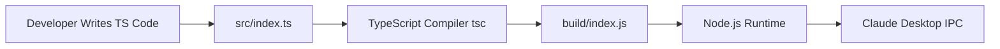

# MCP - Model Context Protocol

## About MCP

The **Model Context Protocol (MCP)** is an open standard that enables developers to build secure, two-way connections between their data sources and AI-powered tools. The architecture is straightforward: developers can either expose their data through MCP servers or build AI applications (MCP clients) that connect to these servers.

👉 [Learn more](https://www.anthropic.com/news/model-context-protocol)

---

MCP follows a **client-server architecture** where a host application can connect to multiple servers.

---

##  Architecture

src/    → TypeScript source  
build/  → Compiled JavaScript
```

```bash
weather/
├── src/        # TypeScript source
│   └── index.ts
├── build/      # Compiled JavaScript
│   └── index.js
├── tsconfig.json
└── package.json
```

---

### `src/` Directory (TypeScript Source)

**Purpose:**

- Contains **development-time** code written in TypeScript
- You implement MCP protocol handlers here (Resources, Tools, Prompts)
- Also contains logic, type definitions, SDKs, etc.

**Key Files:**

- `index.ts` → Entry point for your MCP server  
- MCP concepts:
  - `resources/` → MCP Resource implementations
  - `tools/` → LLM-callable functions
  - `prompts/` → Prompt templates / management

---

### `build/` Directory (Compiled JavaScript)

**Purpose:**

- Holds **runtime** code after TS compilation
- This is the folder Claude Desktop interacts with via:  
  `node build/index.js`

**Traits:**

- Compiled, production-ready JavaScript
- No TS needed after this stage
- Clean deployable output

---

## ⚙️ Data Flow Pipeline



##  What Happens After `index.js`

Once your `index.js` is ready, it flows like this:

Claude Desktop ↔ stdio ↔ Server Transport ↔ McpServer ↔ Tools (1)


